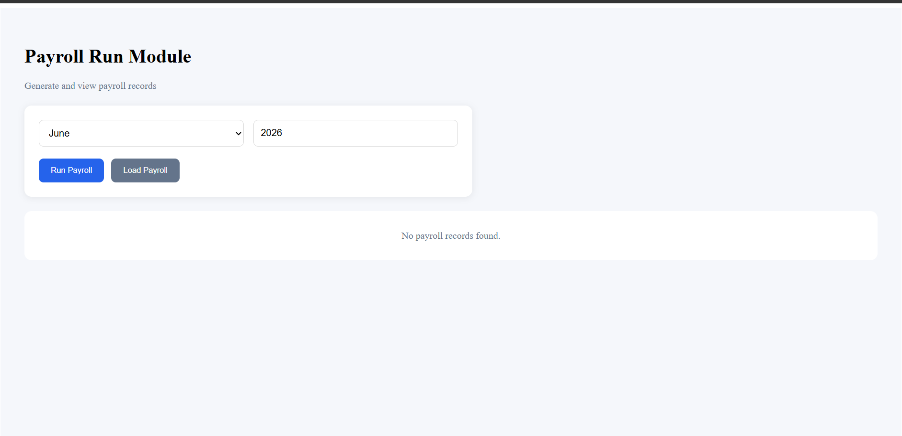
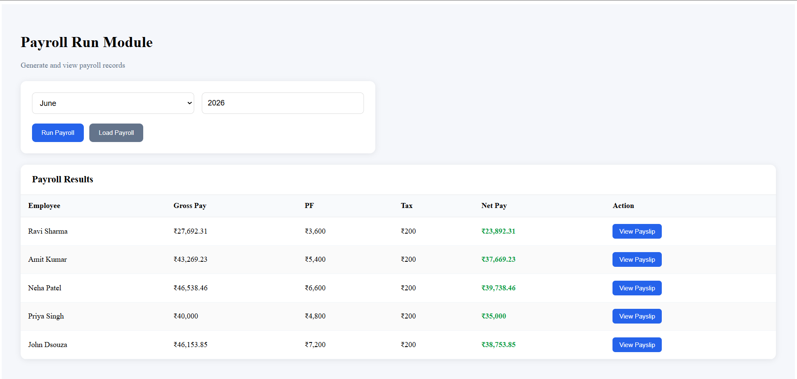
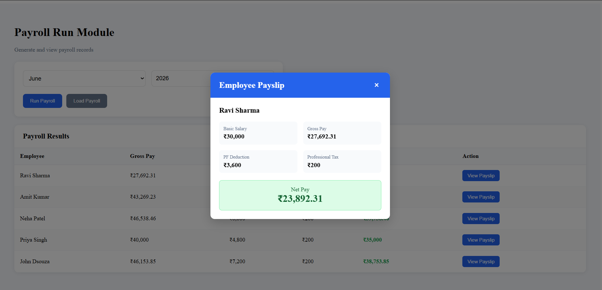

# Candidate: Abdul Karim Morve

# Assessment: Payroll Run Module

## Overview

This project is a Payroll Run Management System built using ASP.NET Core (.NET 10), Dapper, SQL Server, React, and TypeScript.

The application allows payroll administrators to:

* View employees
* Generate payroll for a selected month and year
* Prevent duplicate payroll runs
* Retrieve generated payroll records
* View employee payslips

---

## Screenshots

### Payroll Dashboard



### Payroll Results



### Payslip



---

## Technology Stack

### Backend

* ASP.NET Core (.NET 10)
* Dapper
* SQL Server LocalDB
* Stored Procedures
* Swagger / OpenAPI
* xUnit

### Frontend

* React
* TypeScript
* Axios
* Vite

### Database

* SQL Server
* Stored Procedure based payroll processing

---

## Project Structure

```text
PayrollRunSolution

├── Payroll.API
├── Payroll.Application
├── Payroll.Domain
├── Payroll.Infrastructure
├── Payroll.Tests
├── payroll-ui
├── Database
│   ├── Schema.sql
│   ├── SeedData.sql
│   └── StoredProcedures
│       └── usp_RunPayroll.sql
├── screenshots
│   ├── home-page.png
│   ├── payroll-results.png
│   └── payslip-modal.png
└── README.md
```

---

# Quick Start

## 1. Clone the Repository

```bash
git clone <repository-url>
cd PayrollRunSolution
```

---

## 2. Create Database

Open SQL Server Management Studio and execute:

```sql
CREATE DATABASE PayrollDB;
GO
```

---

## 3. Execute Database Scripts

Run the following scripts in the exact order:

1. Database/Schema.sql
2. Database/SeedData.sql
3. Database/StoredProcedures/usp_RunPayroll.sql

---

## 4. Configure Connection String

Update:

```text
Payroll.API/appsettings.json
```

Example:

```json
{
  "ConnectionStrings": {
    "DefaultConnection": "Server=(localdb)\\MSSQLLocalDB;Database=PayrollDB;Trusted_Connection=True;TrustServerCertificate=True;"
  }
}
```

---

## 5. Run Backend API

Navigate to:

```bash
cd Payroll.API
```

Run:

```bash
dotnet run
```

Swagger UI:

```text
https://localhost:7025/swagger
```

---

## 6. Run Frontend Application

Navigate to:

```bash
cd payroll-ui
```

Install dependencies:

```bash
npm install
```

Run application:

```bash
npm run dev
```

Application URL:

```text
http://localhost:5173
```

---

## 7. Run Unit Tests

From the solution root:

```bash
dotnet test
```

The test project contains unit tests for payroll calculation logic.

---

## Database Setup

### Database Name

```text
PayrollDB
```

### Connection String Format

```text
Server=(localdb)\MSSQLLocalDB;
Database=PayrollDB;
Trusted_Connection=True;
TrustServerCertificate=True;
```

### Database Scripts

| Script             | Purpose                                     |
| ------------------ | ------------------------------------------- |
| Schema.sql         | Creates tables and relationships            |
| SeedData.sql       | Inserts sample employee and attendance data |
| usp_RunPayroll.sql | Creates payroll processing stored procedure |

---

## API Endpoints

### Get Employees

```http
GET /api/employees
```

---

### Run Payroll

```http
POST /api/payroll/run
```

Request:

```json
{
  "month": 6,
  "year": 2026
}
```

---

### Get Payroll

```http
GET /api/payroll/{month}/{year}?pageNumber=1&pageSize=10
```

Example:

```http
GET /api/payroll/{month}/{year}?pageNumber=1&pageSize=10
```

---


### Get Payslip

```http
GET /api/payroll/{runId}/slip/{employeeId}
```

Example:

```http
GET /api/payroll/1/slip/1
```

---

## Frontend Features

* Generate payroll for a selected month and year
* Load existing payroll records
* View payroll results in a responsive table
* View employee payslip in a modal dialog
* Printable employee payslip view using browser print functionality
* Offset-based pagination implemented for payroll retrieval
* Loading indicators
* Success and error notifications
* Responsive layout

---

## Payroll Rules

### Gross Pay

```text
(Basic Salary / Working Days) × Days Present
```

### PF Deduction

```text
12% of Basic Salary
```

### Professional Tax

```text
₹200 fixed deduction
```

### Net Pay

```text
Gross Pay - PF Deduction - Professional Tax
```

---

## Business Validations

* Duplicate payroll runs are not allowed.
* Attendance records must exist before payroll generation.
* Inactive employees are excluded from payroll processing.
* Payroll runs are stored as finalized records.
* Only one payroll run is allowed per month/year combination.

---

## Assumptions

The following assumptions were made during implementation:

* Professional Tax is a fixed ₹200 deduction.
* PF deduction is calculated as 12% of Basic Salary.
* Attendance data is available before payroll generation.
* Inactive employees should not be included in payroll calculations.
* Payroll records are treated as finalized once generated.
* One payroll run is permitted for a given month and year.

---

## Unit Testing

The solution includes xUnit tests covering payroll calculation logic:

* Gross Pay calculation
* PF deduction calculation
* Net Pay calculation

Run tests:

```bash
dotnet test
```

---

## Error Handling

| Scenario               | Status Code               |
| ---------------------- | ------------------------- |
| Payroll already exists | 409 Conflict              |
| Attendance not found   | 400 Bad Request           |
| Payroll not found      | 404 Not Found             |
| Payslip not found      | 404 Not Found             |
| Unexpected error       | 500 Internal Server Error |

---

## Design Decisions

* Layered architecture (API, Application, Infrastructure, Domain)
* Dapper chosen for lightweight and performant data access
* Stored Procedure used for payroll generation as required by the assessment
* Custom exceptions used for business rule violations
* Consistent API response model implemented using `ApiResponse<T>`
* React + TypeScript used for frontend implementation
* Payroll calculation logic extracted and unit tested using xUnit
* Reusable custom hooks used for frontend state management

---

## Items Not Completed

Due to assessment time constraints, the following enhancements were not implemented:

* Authentication and authorization
* Global exception handling middleware
* Audit logging
* Export payslip as PDF
* Docker containerization
* CI/CD pipeline integration

---

## Future Enhancements

Given additional time, I would:

* Add JWT-based authentication and authorization
* Implement global exception middleware
* Add audit trail tracking for payroll runs
* Containerize the application using Docker
* Configure CI/CD using GitHub Actions
* Improve accessibility and UI/UX

---

## Known Limitations

* Payroll processing is performed through a SQL Server stored procedure as required by the assessment.
* Seed data is intended for demonstration and testing purposes.
* The application currently supports a single payroll processing workflow without user management.

---

## Notes

During implementation, an additional validation was introduced to prevent payroll generation when attendance data is unavailable for the selected month and year.

This prevents incomplete payroll runs from being created and improves overall data integrity.
